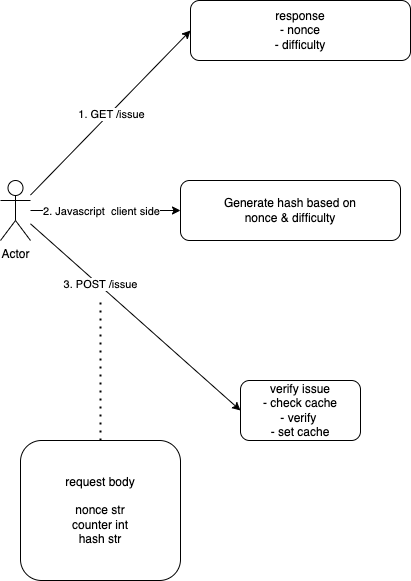

### Rate Limiter Using Proof of Work
An improvement of the medium article.

### From The Article
<b>So how do you rate limit an unauthenticated endpoint?</b><br>
What we wanted was to be able to limit requests on site (i.e. baked into the application) without relying on services like Cloudflare, CAPTCHA, or an API gateway.

<b>Solution 1:</b><br>
We don’t. find a way to scale out instead.<br>

Just grow the pool of available ids. The current implementation uses a five character long case insensitive alpha-numeric-hyphen-underscore string for ids. Even adding just one more character would raise the ceiling to about two billion. It would be significantly harder to exhaust the pool with a longer id string. But still leaves the problem that the malignant actor could still use those thousands of keys to make requests that load the servers deeper in the stack.<br>

<b>Solution 2:</b><br>
Rate limit by IP addresses. A simple solution but poses problems if user IPs are masked by NATs.<br>

<b>Solution 3:</b><br>
Throttle the endpoint. Limit the amount of session tokens that can be issued per some interval of time.<br>

This solution however creates a new problem elsewhere. The problem now is one of queuing and timeouts. A malignant actor could in theory shutdown the creation of new well intentioned sessions by queuing some arbitrarily many new session requests and fill the queue of waiting requests to a point where any new requests get timed-out.<br>

<b>The Solution</b><br>
Use blockchain! Kinda-sorta.<br>
We would use proof of work like those used in blockchain to artificially limit the number of sessions any one client can create. Getting a new session token would require the client do a partial hash reversion to claim it. We can now raise and lower the difficulty of getting a new token by requiring more or less leading zeros on a solution hash. This solution allows the API to run as it had, without rate limiting by IP address, or throttling, but still limit the rate of session creation.

### Run project
```bash
docker run \
    -p 6379:6379 \
    redis:7.0.7

go run main.go
```

[Jump to the demo](http://localhost:8000)

### APIs


### Reference
[The Curious Problem of Rate Limiting an Unauthenticated Endpoint](https://medium.com/@jycho1998/the-curious-problem-of-rate-limiting-an-unauthenticated-endpoint-9464e315fdaf)
